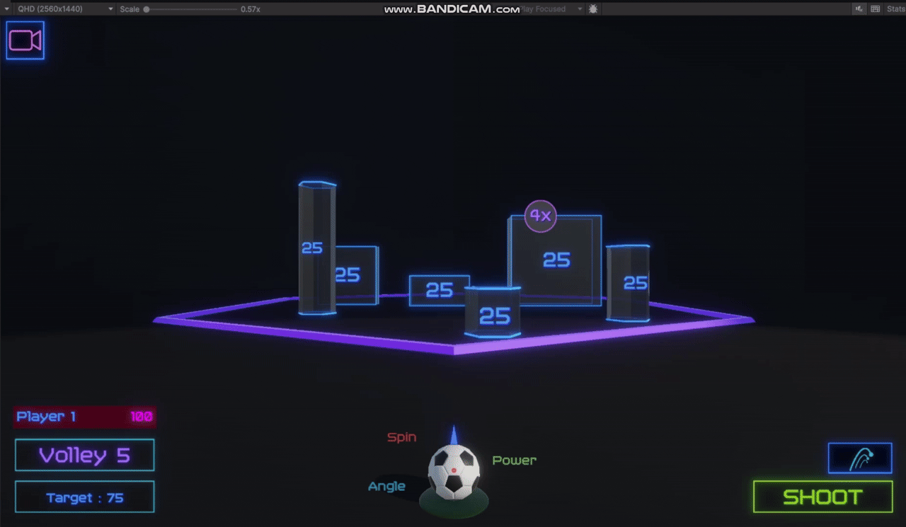
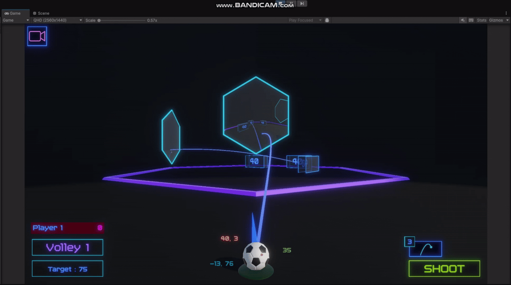

# 🎯 Strike – Physics Trick Shot Game

*Strike* is a fast-paced 2D physics game where players launch customizable balls to knock over collectibles in a freeform arena. Unlike traditional bowling-style games, *Strike* encourages creativity through swipes, ball abilities, and dynamic environments like portals and danger zones.

---

> ⚠️ **Work in Progress:** This game is currently in development. New features, visuals, and polish are still being added.
>
> 🎨 This is a solo project — all design, programming, and visual effects were done without an artist. The game's appearance is driven entirely by custom shaders, code-based visuals, and gameplay-driven ideas.

---

## 🕹 Gameplay Highlights

- ⚡ **Swipe-Based Controls** – Full-screen swipes determine angle, power, and spin. Controls feel intuitive but reward mastery.
- 🎯 **Wacky Ball Abilities** – Special ball types like:
  - **Sniper** – Shows a projected impact point.
  - **Shotgun** – Fires multiple pellets in a spread.
  - **Glass Ball** – Shatters on impact with the ground.
- 🌀 **Two-Way Portal System** – Seamless teleportation with preserved velocity and spin. Handles both kinematic and physics-driven motion.
- 💥 **Juicy Feedback** – Camera shake, shader flashes, and satisfying hit effects for rewarding gameplay.
- 🎮 **Game Modes** – Multiple challenges including:
  - Target Score Mode
  - Limited Shots Mode
  - Dartboard Mode
  - Danger Pins Mode
- 🧠 **Strategic Depth** – Multipliers change the value of your hits based on shot order.

---

## 🌐 Web Optimization

*Strike* was built from the ground up with **WebGL deployment** in mind:

- 📦 **Memory-Efficient Design** – All object pooling, data structures, and caching strategies are tuned to minimize GC spikes and heap allocations. Avoided excessive LINQ, boxing, and per-frame allocations.
- 🎮 **Lightweight Assets** – Game art, shaders, and audio were tightly optimized to reduce build size and loading times.
- ⏱ **Lean Code Execution** – Clean update loops, minimal coroutines, and stateless interactions wherever possible.
- 🧹 **Aggressive Scene Cleanup** – Proactive disposal and lifecycle management for objects and UI panels. Unused references cleared post-use.
- 🧪 **Performance Testing** – Built-in dev tools to track FPS, memory usage, and simulate long sessions without reloads.

---

## 🧪 Systems & Architecture

### 🧩 Modular Ball Ability Framework
- Abilities are completely decoupled from triggering logic.
- Same abilities work in-game, in preview scenes, and in tutorials by responding to abstracted context events.
- Designed for scalability and reuse across future balls.

### 🧠 Context-Aware Architecture
- Every system (abilities, collectibles, UI) consumes context via the `IContextProvider` interface.
- Game and menu modes provide different context implementations without changing the consuming code.

### 📢 Event-Driven Architecture
- Built on a **custom lightweight EventBus** for decoupling systems.
- Events are strongly-typed and memory-safe, with no reliance on UnityEvents or MonoBehaviours.
- Components **listen for and raise events** without needing direct references.
- Example: Game state changes → UI updates, music transitions, and tutorials all respond independently.

## 🎬 Previews

### Ball Selection Page

  

A quick look at how players browse and compare ball abilities in the selection menu.

### Shooting Mechanics

 
   

 
A demonstration of the swipe-based shooting mechanic, where angle, power, and spin are determined by user input.

### Camera Control

   

A look at how the player can switch camera angles and set camera bahviour like staying in place or the camera following the ball

### Shots History

   

Enables players to view their shot history and what Spin, Angle, and Power they used, and how many points that shot fetched

### Portals

  

A showcase of the two-way portal system that maintains physics velocity and spin through seamless teleportation.

### Shotgun Ball

  

The Shotgun Ball ability unleashes a burst of projectiles in an arc, perfect for hitting multiple scattered targets.

### Sniper Ball

  

The Sniper Ball shows an impact point preview, letting players line up precision shots before committing.
